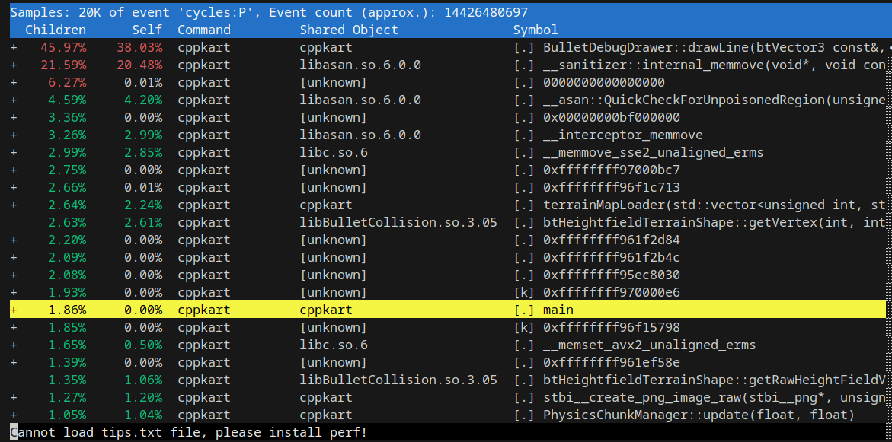

# General Debugging Notes

Using `ldd ./<app>` on Linux will tell you the **Dynamic Libraries** your Program is using !

**Example:**  `ldd ./cppkart`

OUTPUT:

```
linux-vdso.so.1 (0x00007fff2efca000)
libasan.so.6 => /lib/x86_64-linux-gnu/libasan.so.6 (0x00007fedaaa00000)
libSDL2-2.0.so.0 => /lib/x86_64-linux-gnu/libSDL2-2.0.so.0 (0x00007fedaa860000)
libBulletDynamics.so.3.05 => /lib/x86_64-linux-gnu/libBulletDynamics.so.3.05 (0x00007fedab8a8000)libBulletCollision.so.3.05 => /lib/x86_64-linux-gnu/libBulletCollision.so.3.05 (0x00007fedaa78b000)
libLinearMath.so.3.05 => /lib/x86_64-linux-gnu/libLinearMath.so.3.05 (0x00007fedaa768000)
libBulletSoftBody.so.3.05 => /lib/x86_64-linux-gnu/libBulletSoftBody.so.3.05 (0x00007fedaa6de000)
libassimp.so.5 => /lib/x86_64-linux-gnu/libassimp.so.5 (0x00007feda9e00000)
libGLX.so.0 => /lib/x86_64-linux-gnu/libGLX.so.0 (0x00007fedaa6aa000)
libOpenGL.so.0 => /lib/x86_64-linux-gnu/libOpenGL.so.0 (0x00007fedaa67e000)
libz.so.1 => /lib/x86_64-linux-gnu/libz.so.1 (0x00007fedaa662000)
.
.
.
```

# General Profiling Notes

*Benchmarking* : Reliable, Repeatable Infrastructure for running benchmarks, like Unit test, but not for correctness

**intel VTune** for Intel Hardware Specifically, It's part of Intel System Studio Suite, maybe isn't the best... as I need to install lots of stuff, and it's propritary & paid software..

### **Perf** 
* Part of Linux Kernel *x86, ARM, PPC, SH Processors*
* CLI Tool, quite easy to use!

`sudo apt-get install linux-tools-common linux-tools-generic`

For *Tools-Generic*, I need to use this package specifically:
<br>

`sudo apt-get install linux-tools-6.5.0-14-generic`

* The Kernel protects you from running programs with *Perf*, so you need to switch a setting
* `cd ~ && cd ../../proc/sys/kernel` Go beneath the *users* directory into main fs, and into kernel folder
* Change `perf_event_paranoid` file from **4** to **-1** *(Turning off Kernel safe-guards)*

#### Executing & Profiling with Perf

* `perf record -g ./cppkart`  | This wil run the application, but record CPU function scheduling, usage, etc...
* After closing app, view the Report `perf report`  | Press **q** to exit



- **Children:** Percentage of time spent in the function itself and its children (functions it called).
- **Self:** Percentage of time spent in the function itself, excluding its children.
- **Command:** The name of the command or process *(My game is a single-process application)*
- **Shared Object:** The binary or library where the function resides.
- **Symbol:** The function or symbol name where time is spent. *(Usually Class & Function identifiers)*